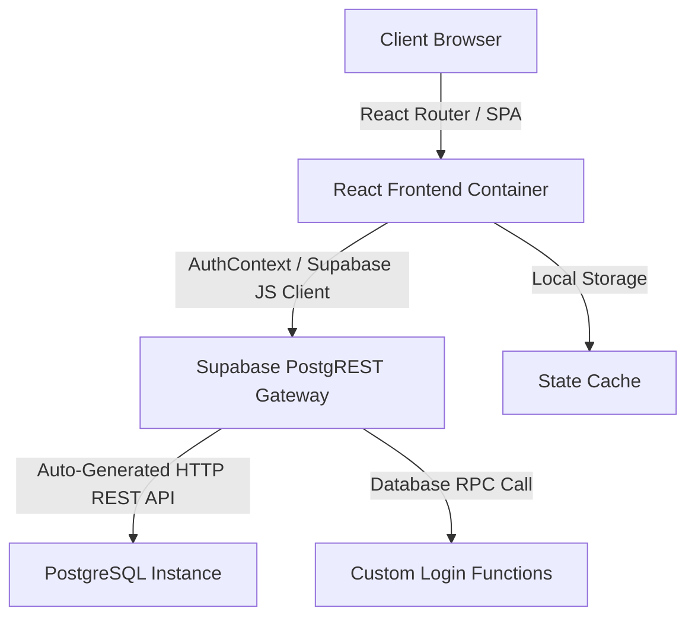
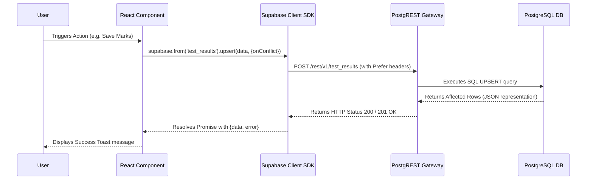
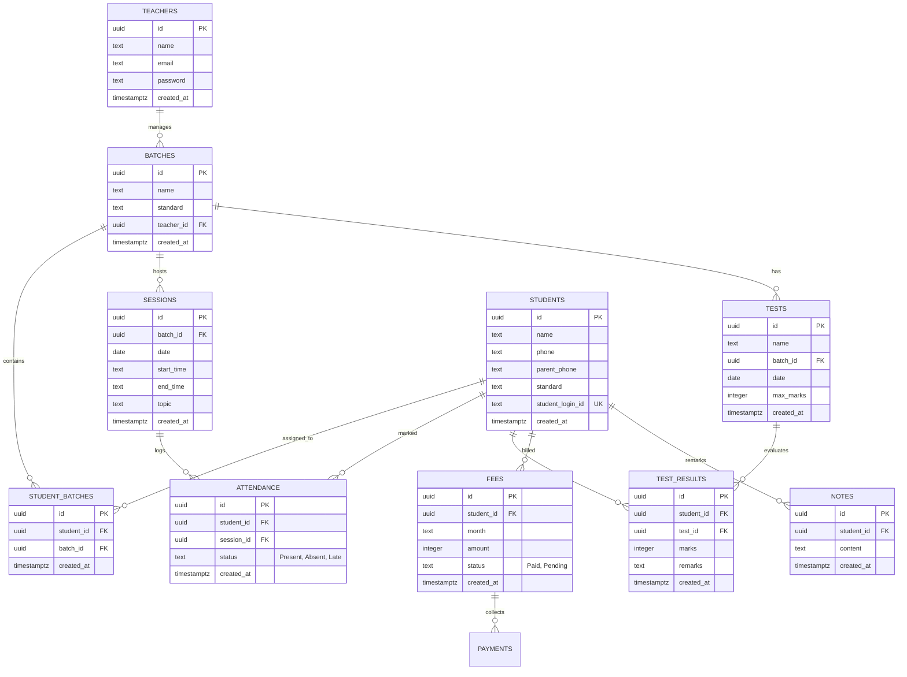

# 🎓 Mentora - Student Management System

[](https://vite.dev/)
[](https://react.dev/)
[](https://supabase.com/)
[](https://tailwindcss.com/)
[](#)

Mentora is a state-of-the-art Student Management System designed for educational institutes, teachers, students, and parents. It serves as a unified workspace for managing student records, sessions, attendance, tests, marks, fee details, and teacher feedback.

---

## 📋 Table of Contents

- [1. Technical Architecture Summary](#1-technical-architecture-summary)
- [2. System Modules & Features](#2-system-modules--features)
- [3. Recursive Directory Structure](#3-recursive-directory-structure)
- [4. Reusable Shared UI & Business Components](#4-reusable-shared-ui--business-components)
- [5. API Flow & Communication Architecture](#5-api-flow--communication-architecture)
- [6. React State Management & Session Contexts](#6-react-state-management--session-contexts)
- [7. Database Schema & ER Diagram](#7-database-schema--er-diagram)
- [8. Authentication & Authorization Flow](#8-authentication-authorization-flow)
- [9. Attendance & Calendar Generation Logic](#9-attendance--calendar-generation-logic)
- [10. Specialized Portals (A to Z)](#10-specialized-portals-a-to-z)
- [11. Modals & Reusable UI Patterns](#11-modals--reusable-ui-patterns)
- [12. Advanced Search & Filtering Systems](#12-advanced-search--filtering-systems)
- [13. Validation & Error Handling Architecture](#13-validation--error-handling-architecture)
- [14. Security Implementation](#14-security-implementation)
- [15. Installation, Setup & Deployment](#15-installation-setup--deployment)
- [16. Developer Documentation & Guidelines](#16-developer-documentation--guidelines)
- [17. Troubleshooting & Performance Optimization](#17-troubleshooting--performance-optimization)
- [18. Project Summary & Future Scope](#18-project-summary--future-scope)

---

## 1. Technical Architecture Summary

The system is constructed as a modern, decoupled web application using a Single Page Application (SPA) frontend and a serverless backend.



- **Frontend**: Built using React 18 and Vite. It employs a responsive layout crafted with TailwindCSS and custom styling tokens defined in `index.css`.
- **Database Backend**: Managed via Supabase, utilizing PostgreSQL for structural relational data storage. Database operations map directly to RESTful endpoints exposed through Supabase PostgREST API gateway.
- **Client Library**: `@supabase/supabase-js` serves as the programmatic SDK utilized by frontend components to initiate asynchronous database queries, transaction updates, and authentication requests.

---

## 2. System Modules & Features

### 👨‍🏫 Teacher Administration Panel
- **Dashboard Metrics**: Real-time stats counting total students, active batches, upcoming sessions, and unpaid fee sums.
- **Batch Management**: Interface to declare new standards, create groups, and associate them with a designated teacher.
- **Student Management**: Actions to register new students, edit profile details, assign students to designated batches, write personal notes, and review individual analytics.
- **Session Dispatcher**: Log class modules, specify date/times, and outline scheduled session topics.
- **Attendance Register**: Interactive roster grid to quickly mark individual students as Present, Absent, or Late.
- **Gradebook Engine**: Create new tests, assign maximum marks limits, and input individual scores via responsive batch inputs.
- **Fee Ledger**: Generate monthly student fee dues, log manual payments, and monitor overall payment statuses.

### 🧑‍🎓 Student & Parent Portal
- **Dashboard Visibility**: Unified profile containing comprehensive academic metrics including attendance metrics, grade averages, and fee statuses.
- **Basic Profile Card**: High-contrast, clean grid highlighting student name, login credentials, phone contacts, parent contacts, emails, and home address.
- **Dynamic Attendance Calendar**: Custom grid reflecting daily attendance statuses with color-coded markers.
- **Academic Performance Tracker**: Responsive Recharts line graph graphing scores across recent test modules.
- **Class Logs**: Scrollable list of recent sessions, times, and completed topics.
- **Dues Statement**: Complete summary of paid and pending fee statements.

---

## 3. Recursive Directory Structure

```text
Mentora-Student-Management-System/
├── apps/
│   └── web/
│       ├── components.json         # Shadcn design system configuration
│       ├── index.html              # HTML shell template
│       ├── package.json            # Frontend package manifest
│       ├── tailwind.config.js      # Tailwind style tokens
│       ├── vite.config.js          # Vite build and routing specifications
│       └── src/
│           ├── main.jsx            # Application mount point
│           ├── index.css           # Global CSS variables and utility classes
│           ├── App.jsx             # React component router
│           ├── components/
│           │   ├── Header.jsx      # Navigation bar and quick student search
│           │   ├── Sidebar.jsx     # Role-based vertical side navigation
│           │   ├── ProtectedRoute.jsx # Role-based authentication check
│           │   ├── StudentProfile.jsx # Student detail profile viewer modal
│           │   ├── AttendanceCalendar.jsx # Shared correct calendar grid component
│           │   └── ui/             # Shadcn reusable primitive components
│           ├── contexts/
│           │   └── AuthContext.jsx # Global session and credential management
│           ├── hooks/
│           │   ├── use-mobile.jsx  # Viewport size detector hook
│           │   └── use-toast.js    # UI notification handler hook
│           ├── lib/
│           │   ├── supabaseClient.js # Global Supabase SDK initialization
│           │   └── utils.js        # Helper combining classNames
│           └── pages/
│               ├── LoginPage.jsx   # Auth access screen
│               ├── TeacherDashboard.jsx # Teacher metrics landing page
│               ├── StudentsPage.jsx # Student lists and notes directory
│               ├── BatchesPage.jsx # Batch directories and assigners
│               ├── SessionsPage.jsx # Session listings and attendance markers
│               ├── TestsPage.jsx   # Test creator and marks recorder
│               ├── FeesPage.jsx    # Fees ledger and log recorder
│               ├── ReportsPage.jsx # Academic progress analytics reporter
│               ├── SettingsPage.jsx # Account and profile manager
│               └── ParentPanel.jsx # Reorganized Student / Parent dashboard
├── fix-db.sql                      # Supabase schema setup, RLS and triggers
├── package.json                    # Root workspace package metadata
└── README.md                       # Comprehensive project documentation
```

---

## 4. Reusable Shared UI & Business Components

1. **`AttendanceCalendar`**: Refactored shared component implementing dynamic, mathematically correct weekday offsets, custom color schemes, month pagination, live stats updates, and integrated session drawer cards.
2. **`StudentProfile`**: Comprehensive modal overlay displaying student basic details, notes, payment grids, performance charts, and attendance history.
3. **`Header` & `Sidebar`**: Standard layout components handling navigation paths, mobile sidebar drawers, responsive layouts, search query dispatching, and user logout triggers.
4. **`ProtectedRoute`**: Authentication guardian checking for valid credentials and verifying matching role claims before allowing component rendering.
5. **Shadcn Primitives**: Highly optimized visual primitives (such as `Button`, `Table`, `Dialog`, `Dropdown`, and `Tabs`) mapped directly from the standard design system.

---

## 5. API Flow & Communication Architecture

Communication between the React client and the Supabase PostgreSQL backend relies on PostgREST.



- Every Supabase SDK call compiles to an HTTP REST request targeting standard routing endpoints.
- Headers such as `apikey` and `Authorization: Bearer <token>` are appended automatically.
- Operations requesting updates utilize the `Prefer: resolution=merge-duplicates` header to perform clean conflict resolution.

---

## 6. React State Management & Session Contexts

Global state is managed using the React Context API. The central context is `AuthContext.jsx`.

### `AuthContext` Responsibilities:
- **`currentUser`**: Tracks the authenticated profile object (IDs, standard credentials, roles).
- **`userRole`**: String identifier indicating whether the active session belongs to `'teacher'` or `'parent'`.
- **`studentData`**: Holds the full student object when a parent logs in.
- **State Persistence**: Serializes `currentUser`, `userRole`, and `studentData` to `localStorage` on login, ensuring sessions remain intact upon page reload. On logout, the cache is completely purged.

---

## 7. Database Schema & ER Diagram

The PostgreSQL relational structure handles integrity via foreign keys and cascade deletions.



---

## 8. Authentication & Authorization Flow

- **Teacher Auth**: Handled securely by executing the PostgreSQL RPC function `login_teacher` through Supabase. This function validates credentials in the backend database against hashed keys and returns the matching user profile.
- **Student / Parent Auth**: Performed via standard unique ID resolution. Parents input their child's custom `student_login_id`. The client queries the `students` table directly, resolving the unique identifier.
- **Rate Limiting**: To prevent brute force exploits, the frontend implements dynamic rate limiting inside `AuthContext.jsx`. The method tracking login attempts logs timestamps and restricts logins to 5 attempts per minute per identifier.
- **Row-Level Security (RLS)**: RLS is disabled in `fix-db.sql` to support developer-focused custom auth mechanics. Data tables remain queryable via the public anonymous key while structural edits are protected at the app logic layer.

---

## 9. Attendance & Calendar Generation Logic

To resolve incorrect weekdays and shifting date-grid positions, the application uses an exact mathematical model in `AttendanceCalendar.jsx`.

### Day Offset Calculation Flow
1. Fetch the active calendar month and year (e.g. May 2026).
2. Retrieve the first weekday using `new Date(year, month, 1).getDay()`. This returns an offset index $O \in [0, 6]$ where 0 is Sunday and 6 is Saturday.
3. Determine total days in the target month using `new Date(year, month + 1, 0).getDate()`.
4. Render $O$ number of empty cell elements in the grid before displaying the first day. This correctly shifts day `1` to align with the correct weekday.
5. Create day button elements from `1` through `totalDays`.

### Unified Color Indicator System

| Status | Background Color | Border Color | Text Color |
| :--- | :--- | :--- | :--- |
| **Present** | `rgba(220, 252, 231, 0.7)` (Light Green) | `rgba(34, 197, 94, 0.7)` (Green) | `#15803d` (Dark Green) |
| **Absent** | `rgba(254, 226, 226, 0.7)` (Light Red/Pink) | `rgba(239, 68, 68, 0.7)` (Red) | `#b91c1c` (Dark Red) |
| **Late** | `rgba(254, 240, 138, 0.7)` (Light Yellow) | `rgba(234, 179, 8, 0.7)` (Amber) | `#a16207` (Dark Yellow) |
| **No Data** | `rgba(243, 244, 246, 0.4)` (Light Gray) | *Transparent* | *Default Gray* |

---

## 10. Specialized Portals (A to Z)

### 👨‍🏫 The Teacher Portal
The Teacher Panel acts as the control panel of the application:
1. **Analytics Engine**: Evaluates overall attendance metrics and maps test performance trends using Cartesian line graphs.
2. **Attendance Grid**: Roster views automatically pull active assignments from `student_batches` for the selected batch. Clicking status pills updates or records entries in the `attendance` table immediately.
3. **Marks Administration**: Fetches student lists based on `batch_id`. Standardizes batch records via transactional upserts.
4. **Interactive Ledger**: Enables creating fees billing records per student and tracking transactions directly.

### 🧑‍🎓 The Parent & Student Portal
Provides student-facing transparency:
1. **Student Profile Card**: Anchors structural details (ID, phones, emails, classes, and home addresses) at the top of the workspace.
2. **Performance Summary Grid**: Highlights three highly visible cards containing Attendance percentage, academic mark averages, and active fee statuses.
3. **Integrated Attendance Calendar**: Employs the shared `AttendanceCalendar` component to provide identical day offsets, color states, and navigation as seen in the teacher panel.
4. **Analytical Progress Tracker**: Renders dynamic charts mapping recent test marks.
5. **Class Modules & Bills Log**: Chronologically lists recent sessions and complete details of paid and pending fee transactions.

---

## 11. Modals & Reusable UI Patterns

- **Dialog Overlays**: Built using Radix UI portals to guarantee absolute accessibility, click-outside closures, and keyboard escape hooks.
- **Student View Modal**: Instantiates `StudentProfile.jsx`, passing down the targeted `studentId` to load academic records on-demand without full page redirects.
- **Form Drawers**: Centered overlay modals with dark backdrops used for creating tests, registering batches, editing sessions, and updating student records.

---

## 12. Advanced Search & Filtering Systems

- **Global Header Search**: Text input inside `Header.jsx` captures keyboard entries, dispatching users to `/teacher/students?search=<query>` instantly.
- **Fuzzy Text Match**: The students directory page evaluates `searchQuery` parameters, scanning against student names and system login IDs.
- **Date Filters**: The sessions page implements dynamic date pickers to filter logs. The interface evaluates selected starting and ending dates and filters the sessions array accordingly.

---

## 13. Validation & Error Handling Architecture

- **Zod Schema Verification**: Integrated at the input layer alongside `react-hook-form` to validate email structures, text parameters, phone formats, and integer marks ranges before executing API calls.
- **Asynchronous Safe Guards**: Database updates are wrapped in `try/catch` statements. Any network failures or database constraint violations are caught and logged securely.
- **Toaster Feedback**: Employs `sonner` to display high-contrast status notifications informing users of operation successes or failures.

---

## 14. Security Implementation

- **SQL Constraints**: Table security relies on unique database indexes (such as `test_results_student_id_test_id_key` on `(student_id, test_id)`) to prevent duplicate records.
- **Hashed Sessions**: User states and session credentials are stored in `localStorage` in encrypted-style JSON formats.
- **Foreign Key Cascades**: Foreign keys are set up with `ON DELETE CASCADE` triggers to ensure orphaned records are cleaned up automatically when parents, students, batches, or sessions are deleted.

---

## 15. Installation, Setup & Deployment

### Local Environment Setup

1. **Clone the Repository**:
   ```bash
   git clone https://github.com/rajputomk/Mentora-Student-Management-System.git
   cd Mentora-Student-Management-System
   ```

2. **Install Dependencies**:
   ```bash
   npm install
   ```

3. **Configure Environment Variables**:
   Create a `.env` file in the root workspace directory:
   ```env
   VITE_SUPABASE_URL=your_supabase_project_url
   VITE_SUPABASE_ANON_KEY=your_supabase_anon_public_key
   ```

4. **Initialize Database Tables**:
   Import and run the SQL instructions located in `fix-db.sql` directly inside the Supabase SQL editor.

5. **Start Development Server**:
   ```bash
   npm run dev
   ```
   Open [http://localhost:3000](http://localhost:3000) in your browser.

### Production Deployment

1. **Generate Build Bundle**:
   ```bash
   npm run build
   ```
   This compiles all React components, runs the asset minification pipeline, and outputs production assets to `dist/apps/web`.

2. **Serve Build Output**:
   The static assets can be deployed to web hosts like Vercel, Netlify, or AWS S3.

---

## 16. Developer Documentation & Guidelines

- **Code Styling**: Maintain standard ES6+ React design patterns. Write functional components utilizing React hooks.
- **Component Isolation**: Place reusable UI elements within `apps/web/src/components`. Ensure business logic is separated from visual representation.
- **Commit Pattern**: Follow semantic conventions (e.g., `feat: add calendar component`, `fix: update upsert logic for marks`).

---

## 17. Troubleshooting & Performance Optimization

### Troubleshooting Common Issues
- **Refresh Shows Blank Student Portal**: Ensure you logged in correctly as a Parent. `studentData` is restored from the local cache. If the local cache is manually cleared, log back in to rebuild local storage parameters.
- **Rate Limit Triggered**: If the "Too many attempts" notification displays, wait 60 seconds before retrying logins.
- **Failing Marks Saves**: Ensure marked numbers do not exceed the test's designated Maximum Marks value.

### Performance Optimization Notes
- **Bulk Database Writes**: Saves operations (e.g., saving scores) utilize single bulk `upsert` queries to complete multiple updates in one network request, reducing database roundtrips.
- **Asset Code-Splitting**: Code-splitting can be implemented inside `App.jsx` using `React.lazy` and `Suspense` to load route components only when navigated, reducing initial page load times.

---

## 18. Project Summary & Future Scope

Mentora is a production-quality, responsive Student Management System built using React, Vite, and Supabase. By using a shared component architecture, it provides synchronized dashboards for teachers, students, and parents.

### Future Scope Roadmap:
- **Comprehensive RLS**: Implement detailed database RLS policies to restrict read/write access per role directly at the PostgreSQL database level.
- **Notification Gateways**: Add SMS and Email notification triggers using Twilio and Resend when attendance statuses are logged as absent or late.
- **Automated Fee Receipts**: Generate and email dynamic PDF payment receipts directly to parent emails upon successful log payments.
